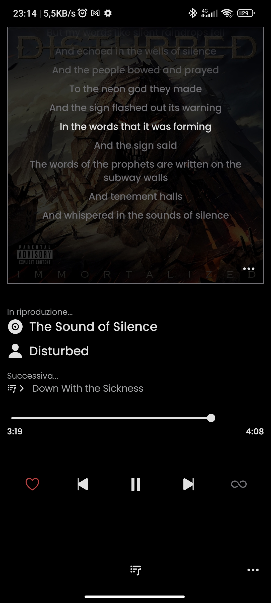
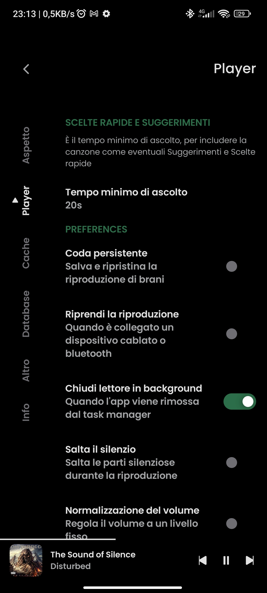
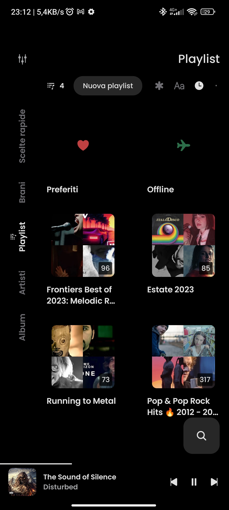
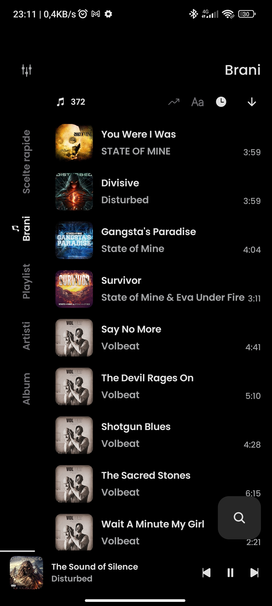
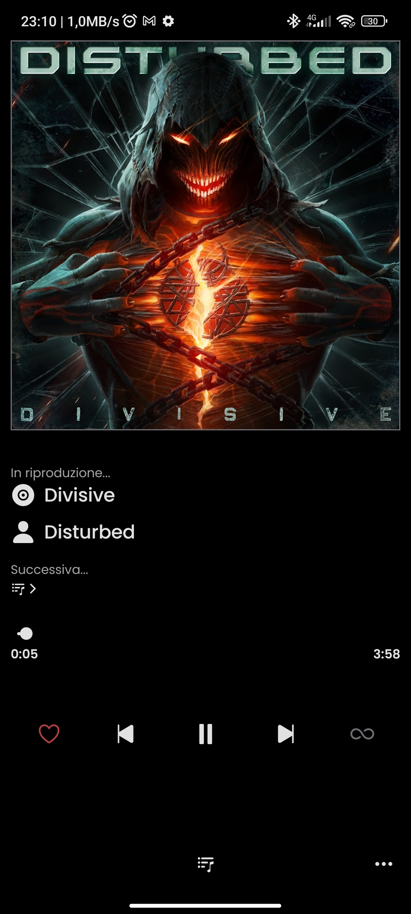

        
    
<b>RiMusic</b> is <b>Multilingual</b> Android application for streaming music from YouTube Music

---
## Features
- **Multilingual support**, English, Italian, German, Russian, French, Spanish, Czech, Turkish, Romanian contribute for other language are welcome
- Play song from YouTube Music 
- Cache songs offline playback
- Background playback
- Background playback stop while app swipe out from task manager
- Minimized player optimized
- Share Menu support for YouTube/YouTube Music links  
- Search for songs, albums, artists and playlists
- Bookmark artists and albums
- Import playlists
- Local playlist management
- Reorder songs in playlist or queue
- Clear queue
- Fetch, display and edit songs lyrics or synchronized lyrics
- Light, Dark, Dynamic, ModernBack themes
- Sleep timer
- Audio normalization
- Audio Skip silence
- Android Auto support
- Persistent queue
- ...
## Screenshot
<h4>Sample screenshot in English language</h4>

  
  
  

  
  
  

<h4>Sample screenshot in Italian language</h4>

  
  
  
  

  
  
  

## Languages Available
* English, initial forked from ViMusic
* Italian, native language, thank to me [@fast4x](https://github.com/fast4x)
* German, native language, thank to [@siggi1984](https://github.com/siggi1984)
* Russian, native language, thank to [@siggi1984](https://github.com/siggi1984)
* French, native language, thank to [@NEVARLeVrai](https://github.com/NEVARLeVrai)
* Czech, native language, thank to [@ikanakova](https://github.com/ikanakova)
* Spanish, native language, thank to [@DanielSevillano](https://github.com/DanielSevillano)
* Romanian, native language, thank to [@OrangeZXZ](https://github.com/OrangeZxZ)
* Turkish, non native language, contribute to improve
* contribute for any other language - see [Contributor's Guide: Adding Translations](https://github.com/fast4x/RiMusic/wiki/Contributor's-Guide:-Adding-Translations)

## Installation
You can dowload it from [**releases page**](https://github.com/fast4x/RiMusic/releases)

<!--

-->

## Contribute
##### Pull Requests are welcome
- **Clone**, if you want to develop new functions, fix bug or translation improvement, finally send your Pull Request.
- **Translate**, if you want to translate into your language or improve the languages already provided, finally send your Pull Request.

## Acknowledgments
- [**ViMusic**](https://github.com/vfsfitvnm/ViMusic): ViMusic
- [**YouTube-Internal-Clients**](https://github.com/zerodytrash/YouTube-Internal-Clients): A python script that discovers hidden YouTube API clients. Just a research project.
- [**ionicons**](https://github.com/ionic-team/ionicons): Premium hand-crafted icons built by Ionic, for Ionic apps and web apps everywhere.
- [**Flaticon**](https://www.flaticon.com/authors/ilham-fitrotul-hayat) App icon based on icon created by Ilham Fitrotul Hayat
- **New logo design** thank to [@ikanakova](https://github.com/ikanakova)

## Disclaimer
This project and its contents are not affiliated with, funded, authorized, endorsed by, or in any way associated with YouTube, Google LLC or any of its affiliates and subsidiaries.

Any trademark, service mark, trade name, or other intellectual property rights used in this project are owned by the respective owners.
