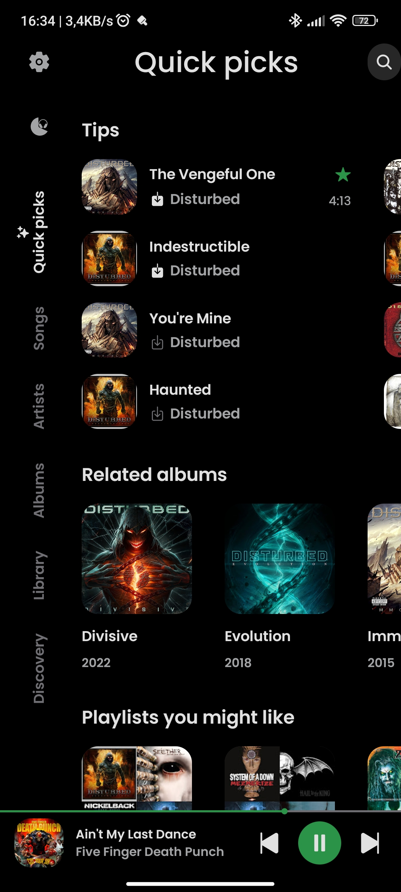
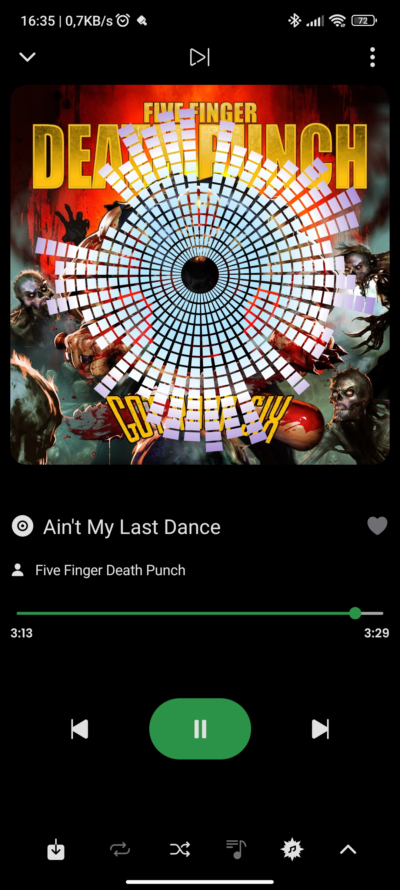
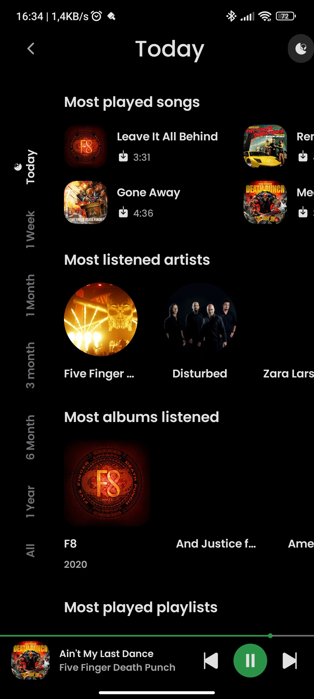
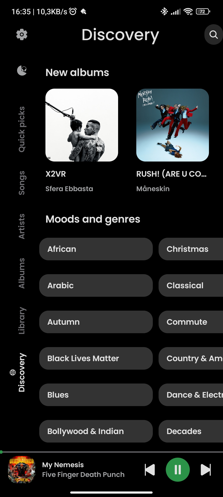
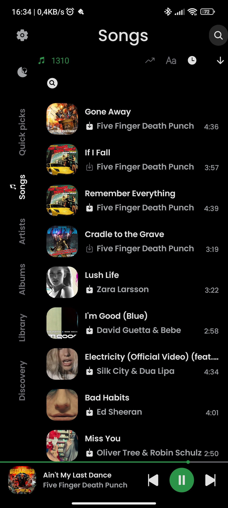
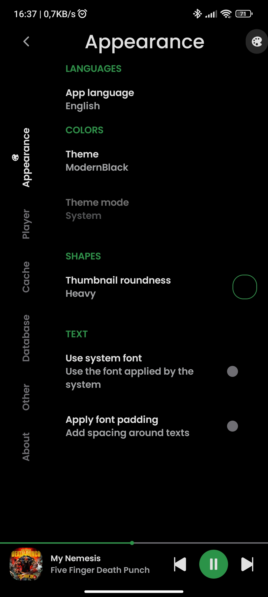

      
  
<b>RiMusic</b> is a <b>multilingual</b> Android application for streaming music from YouTube Music.

  
It was born as an extension of the functionality of <b>ViMusic</b>, which retains the general appearance, colors.

## ✨ Features
- **Multilingual support:** English, Italian, German, Russian, French, Spanish, Czech, Turkish, Romanian and more. Contributions for other languages are welcome
- UI Mode, change style from RiMusic to classic ViMusic style and viceversa
- Play song from YouTube Music
- Change your favorite language from settings
- Auto cache songs for offline playback with custom cache size
- Download songs or entire playlist for offline playback (not cache) 
- Background playback with stop while app swipe out from task manager
- Minimized player optimizations
- Listening statistics
- Audio visualizer on player with many type of effects. THIS FEATURE REQUIRE MIC PERMISSION, ONLY IF ACTIVATE IT FROM SETTINGS. BY DEFAULT IS DISABLED [Full list of permissions](https://github.com/fast4x/RiMusic/wiki/FAQs#-what-permissions-are-used)
- News, mood and musical genres
- New albums from preferites artists
- Search for songs, albums, artists and playlists
- Bookmark artists and albums
- Import playlists
- Local playlist management
- Reorder songs in playlist or queue
- Persistent queue
- Clear queue
- Share menu support for YouTube and YouTube Music links
- Fetch, display, edit and translate synchronized, or not, songs lyrics
- Light, Dark, Dynamic, PureBlack and ModernBack themes
- Sleep timer with custom time
- Audio normalization
- Audio skip silence
- Android Auto support
- Android TV support
- Check for Updates

## 📷 Screenshots

  
  
  
  
  
  

## 🌐 Languages available
- **Arabic:** thanks to [Ahmad Al Juwaisri](https://crowdin.com/profile/juwaisri)
- **Bashkir:** thanks to [Shilave malay](https://crowdin.com/profile/Bash.boy)
- **Catalan:** thanks to [EMC_Translator](https://crowdin.com/profile/EMC_Translator)
- **Chinese Simplified:** thanks to [SharkChan0622](https://github.com/SharkChan0622)
- **Chinese Traditional:** thanks to [SharkChan0622](https://github.com/SharkChan0622)
- **Czech:** thanks to [ikanakova](https://github.com/ikanakova) and [JZITNIK-github](https://github.com/JZITNIK-github)
- **Dutch:** thanks to [BabyBenefactor](https://crowdin.com/profile/BabyBenefactor)
- **English:** thanks to [fast4x](https://github.com/fast4x)
- **Esperanto:** thanks to [kjev666](https://github.com/kjev666)
- **Finnish:** thanks to [rikalaj](https://crowdin.com/profile/rikalaj)
- **French:** thanks to [NEVARLeVrai](https://github.com/NEVARLeVrai)
- **German:** thanks to [Seryoga1984](https://crowdin.com/profile/Seryoga1984) and [Conk](https://crowdin.com/profile/conk) and [siggi1984](https://github.com/siggi1984)
- **Greek:** thanks to [Marinkas](https://github.com/Marinkas)
- **Hebrew:** thanks to [TheCreeperDuck](https://crowdin.com/profile/thecreeperduck)
- **Hungarìan:** thanks to [Ndvok](https://crowdin.com/profile/ndvok)
- **Italian:** thanks to [fast4x](https://github.com/fast4x)
- **Indonesian:** thanks to [teddysulaimanGL](https://github.com/teddysulaimanGL) and [Fausta Ahmad](https://crowdin.com/profile/faustaahmad)  
- **Japanese:** thanks to [Mid_Vur_Shaan](https://crowdin.com/profile/Mid_Vur_Shaan)
- **Korean:** thanks to [TsyQax](https://crowdin.com/profile/TsyQax)
- **Odia:** thanks to [Get100percent](https://github.com/Get100percent)
- **Persian:** thanks to [CUMOON](https://github.com/CUMOON)
- **Polish:** thanks to [AntoniNowak](https://crowdin.com/profile/AntoniNowak) and [roklc](https://github.com/roklc) and [Adam Kop](https://crowdin.com/profile/damianadam000)
- **Portuguese:** thanks to [NEVARLeVrai](https://github.com/NEVARLeVrai)
- **Portuguese, Brazilian:** thanks to [RegularWater](https://crowdin.com/profile/RegularWater) and [NEVARLeVrai](https://github.com/NEVARLeVrai)
- **Romanian:** thanks to [OrangeZXZ](https://github.com/OrangeZxZ)
- **Russian:** thanks to [kptmx](https://crowdin.com/profile/kptmx) and [Crayz310](https://github.com/Crayz310) and [Vladimir](https://crowdin.com/profile/vladimir15426) and [@siggi1984](https://github.com/siggi1984)
- **Spanish:** thanks to [Corotyest](https://crowdin.com/profile/corotyest) and [DanielSevillano](https://github.com/DanielSevillano) and [Fabian Urra](https://crowdin.com/profile/nsagcl)
- **Sinhala:** thanks to [VINULA2007](https://crowdin.com/profile/VINULA2007)
- **Turkish:** thanks to [abfreeman](https://github.com/abfreeman) and [2010furs](https://github.com/2010furs) and [Muha Aliss](https://crowdin.com/profile/muhaaliss)
- **Ukrainian:** thanks to [Crayz310](https://github.com/Crayz310) 
- **Vietnamese:** thanks to [teaminh](https://crowdin.com/profile/teaminh)

## 📲 Installation

## ❓ FAQs
- See [Wiki page FAQs](https://github.com/fast4x/RiMusic/wiki/FAQs)

## 🤝 Contributing
**Pull requests are welcome**
- If you want:
    - to **develop new functions** or **fix a bug**, fork the repository and send a pull request.
    - to **translate** or **improve a translation** read the section Translations
  

## 🔤 Translations
- Go to [Crowdin](https://crowdin.com/project/rimusic/invite?h=73f0e6b64be1c64a8aebd467d286cf851925330) and help with the translations.

## 🤝 Contributors
### **Translator:**
- [2010furs](https://github.com/2010furs)
- [abfreeman](https://github.com/abfreeman)
- [Adam Kop](https://crowdin.com/profile/damianadam000)
- [Ahmad Al Juwaisri](https://crowdin.com/profile/juwaisri)
- [BabyBenefactor](https://crowdin.com/profile/BabyBenefactor)
- [Conk](https://crowdin.com/profile/conk)
- [Corotyest](https://crowdin.com/profile/corotyest)
- [Crayz310](https://github.com/Crayz310)
- [CUMOON](https://github.com/CUMOON)
- [DanielSevillano](https://github.com/DanielSevillano)
- [EMC_Translator](https://crowdin.com/profile/EMC_Translator)
- [Fabian Urra](https://crowdin.com/profile/nsagcl)
- [fast4x](https://github.com/fast4x)
- [Fausta Ahmad](https://crowdin.com/profile/faustaahmad)  
- [Get100percent](https://github.com/Get100percent)
- [ikanakova](https://github.com/ikanakova)
- [JZITNIK-github](https://github.com/JZITNIK-github)
- [kjev666](https://github.com/kjev666)
- [kptmx](https://crowdin.com/profile/kptmx)
- [Marinkas](https://github.com/Marinkas)
- [Muha Aliss](https://crowdin.com/profile/muhaaliss)
- [Mid_Vur_Shaan](https://crowdin.com/profile/Mid_Vur_Shaan)
- [Ndvok](https://crowdin.com/profile/ndvok)
- [NEVARLeVrai](https://github.com/NEVARLeVrai)
- [OrangeZXZ](https://github.com/OrangeZxZ)
- [RegularWater](https://crowdin.com/profile/RegularWater)
- [roklc](https://github.com/roklc)
- [SharkChan0622](https://github.com/SharkChan0622)
- [Shilave malay](https://crowdin.com/profile/Bash.boy)
- [siggi1984](https://github.com/siggi1984)
- [teaminh](https://crowdin.com/profile/teaminh)
- [teddysulaimanGL](https://github.com/teddysulaimanGL)
- [TheCreeperDuck](https://crowdin.com/profile/thecreeperduck)
- [TsyQax](https://crowdin.com/profile/TsyQax)
- [VINULA2007](https://crowdin.com/profile/VINULA2007)
- [Vladimir](https://crowdin.com/profile/vladimir15426)

###  **Developer / Designer:**
- [25huizengek1](https://github.com/25huizengek1)
- [Craeckie](https://github.com/Craeckie)
- [DanielSevillano](https://github.com/DanielSevillano)
- [fast4x](https://github.com/fast4x)
- [ikanakova](https://github.com/ikanakova)
- [locxter](https://github.com/locxter)
- [roklc](https://github.com/roklc)
- [SuhasDissa](https://github.com/SuhasDissa)

## 🫂 Acknowledgments
- [**ViMusic**](https://github.com/vfsfitvnm/ViMusic)
- [**YouTube-Internal-Clients**](https://github.com/zerodytrash/YouTube-Internal-Clients): A python script that discovers hidden YouTube API clients. Just a research project.
- [**Ionicons**](https://github.com/ionic-team/ionicons): Premium hand-crafted icons built by Ionic, for Ionic apps and web apps everywhere.
- [**RiMusic Logo**] [@ikanakova](https://github.com/ikanakova): Designer
- [**Rubik** Font](https://fonts.google.com/specimen/Rubik): Rubik is RiMusic's default font.
- [**Poppins** Font](https://fonts.google.com/specimen/Poppins): Poppins is ViMusic's default font.
- [**Translator**](https://github.com/therealbush/translator): A simple and free Google Translate library for Kotlin/JVM and Java.

## ❗ Disclaimer
This project and its contents are not affiliated with, funded, authorized, endorsed by, or in any way associated with YouTube, Google LLC or any of its affiliates and subsidiaries.

Any trademark, service mark, trade name, or other intellectual property rights used in this project are owned by the respective owners.
